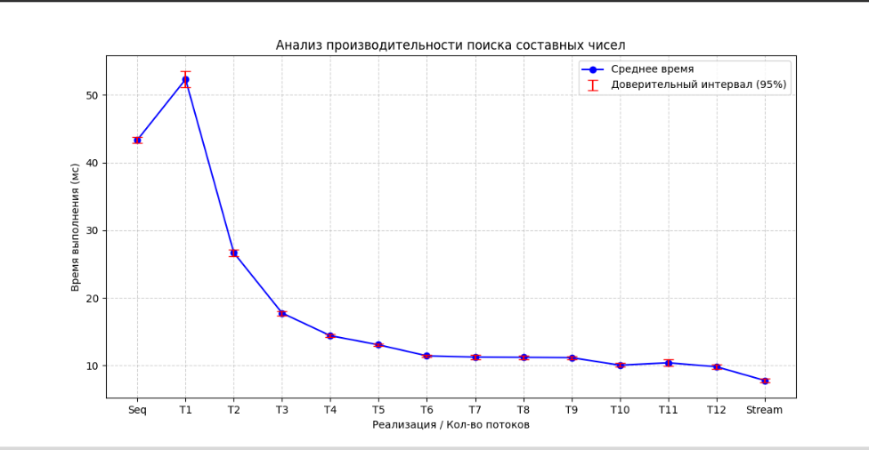

# Нахождение составного числа в массиве чисел
Реализовано 3 алгоритма поиска составного числа в массиве  чисел

11 Последовательный перебор
2. Параллельный поиск с использованием созданых вручную потоков
3. parallel stream

### Обсуждение
Выбор алгоритма зависит от набора данных пользователя. На различных наборах
даннных быстрее будет работать один из алгоритмов. Если данных мало (малоый размер
массива и маленькиепростые числа) то быстрее будет работать последовательный перебор,
так как при нем не требуется создавать потоки. Если размер массива большой а 
сами числа маленькие то предпочтительно исполььзовать алгоритм (2). И если
размер массива мал, а числа в нем большие, то быстрее будет алгоритм (3).

Пример измерений для массива размера 200 состоящего из чисел равных 2147483647L
показан на следующей диаграмме

Рис 1. Скорость работы алгоритмов на массиве из 200 чисел равных 2147483647L
По оси Х представлен алгоритм (последовательный, с потоками: с различным количеством, 
parallel stream). По оси Y отложено среднее время выполнения и 95% доверительный интервал.
Количество проведенных итераций: 100.
